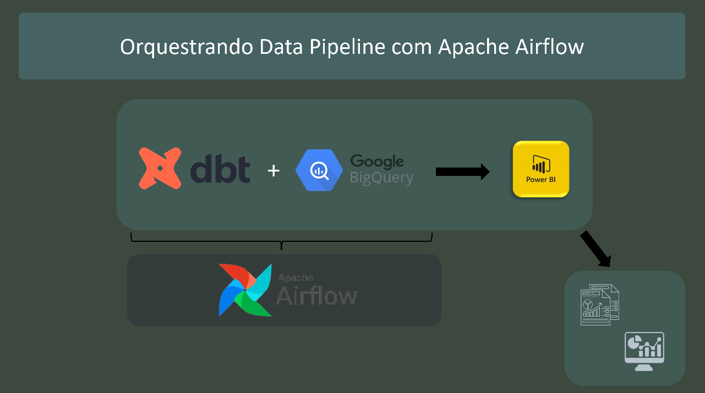
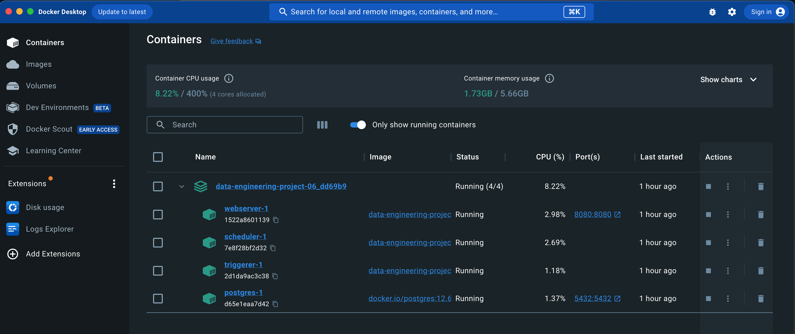
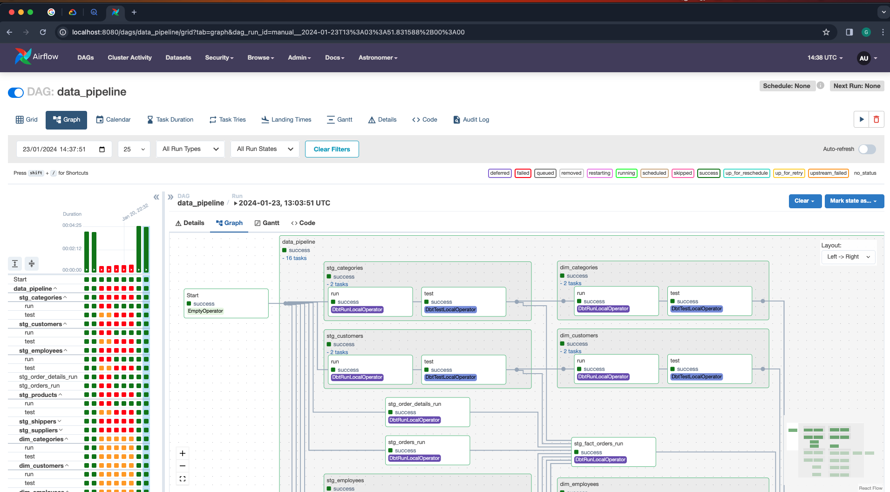
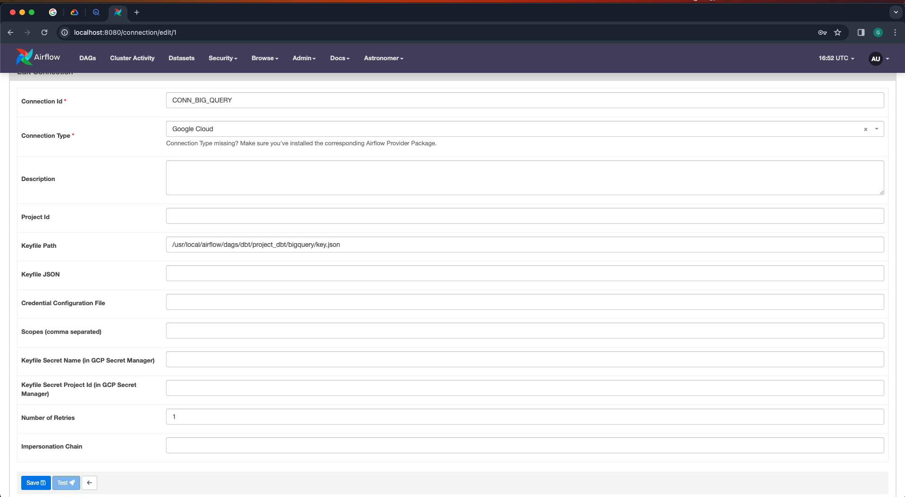

# Orquestrando Data Pipeline com Apache Airflow




## Sobre o Projeto

Este repositório tem como objetivo usar o Apache Airflow para orquestrar o Data Pipeline do projeto dbt usando o Data Warehouse moderno BigQuery e o Power Bi como ferramenta de data viz.

### Pré-requisitos para rodar o projeto

* **Conta Google Cloud Provider**: Cadastro, criação de projeto e chave de acesso para conexão remota com BigQuery.

* **VSCode**: Editor de código. [Instruções de instalação do VSCode aqui](https://code.visualstudio.com/download).

* **Pyenv**: É usado para gerenciar versões do Python. [Instruções de instalação do Pyenv aqui](https://github.com/pyenv/pyenv#installation). Vamos usar nesse projeto o Python 3.10.11. Para usuários Windows, é recomendado assistirem esse tutorial [Youtube](https://www.youtube.com/watch?v=TkcqjLu1dgA).

* **Poetry**: Este projeto utiliza Poetry para gerenciamento de dependências do projeto dbt-core. [Instruções de instalação do Poetry aqui](https://python-poetry.org/docs/#installation). Se você é usuário Windows, recomendo assistir esse vídeo: [Youtube](https://www.youtube.com/watch?v=BuepZYn1xT8). Que instala o Python, Poetry e VSCode. Mas um simples comando PIP INSTALL POETRY já resolve.

* **Docker**: Para subir o container do Apache Airflow. [Instruções de instalação do Docker aqui](https://www.docker.com/products/docker-desktop/).

* **Astro CLI**: Permite iniciar o Apache Airflow rapidamente. 
Instruções de instalação para Windows, Mac e Linux você encontra neste [link](https://github.com/astronomer/astro-cli).


### Instalação e Configuração

1. Clone o repositório :
```bash
git clone https://github.com/gustavobi4yourdata/Data-Engineering-Project-06.git
cd dags/dbt/project_dbt
```

2. Instale as dependências do projeto :
```bash
poetry install
```

3. Ative ambiente virtual :
```bash
poetry shell
```

4. Instale as dependências do projeto dbt :
```bash
dbt deps
```

5. Substitua e copie sua chave se segurança para dentro da pasta `bigquery`

6. Ajuste o caminho do seu arquivo `profiles.yml` em `keyfile`

7. Verifique teste de conexão remota com o bigquery bem como as dependências do projeto dbt-core
```bash
# Certifique-se que você esta no diretório do projeto: 'project_dbt'
dbt debug
```

8. Rode o comando de execução para subir o Apache Airflow em docker container 
```bash
astro dev start
```

## Estrutura do projeto
```graphql
Data-Engineering-Project-06/
│
├── dags/
│    ├── dbt/
│        ├── project_dbt            
│             ├── analyses/
│             ├── bigquery/     # Credencial de acesso remoto ao BigQuery
│             ├── macros/
│             ├── models/       # Modelo dbt-core (processo ETL)
│                 ├── marts/    # Instruções SQL
│                 ├── staging/  # Instruções SQL
│             ├── seeds/
│             ├── snapshot/
│             └── tests/
│── Northwind/
│   ├── tables/                 # Dados importados para o BigQuery
│── PowerBI/
```

#### Seguindo todos os passos acima você vai ter instalado:

* Apache Airflow em docker container



* User Interface do Apache Airflow




Crie a conexão com o BigQuery na guia `Admin` em `Connections` 



### Para rodar o Data Pipeline no Apache Airflow

1. Habilite o `toggle` da dag `data_pipeline`

2. Clique na dag `data_pipeline` e em seguida `Graph`

3. Rode o Data Pipeline em `Trigger DAG`

4. Aguarde o Data Pipeline rodar.


## Contato

Para dúvidas, sugestões ou feedbacks:

* **Gustavo Souza** - [gustavo.souza@bi4yourdata.com](mailto:gustavo.souza@bi4yourdata.com)


